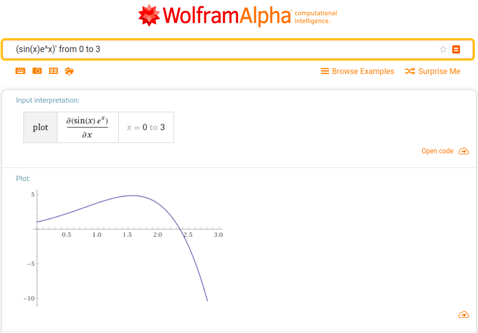

# Computational-Graph

# 计算图第二阶段

## 完成情况综述

| 计划    | 完成 | 描述                                      |
| ------- | ---- | ----------------------------------------- |
| **YES** | YES  | `Placeholder` + `Constant` + 四则运算     |
| **YES** | YES  | sin, log, exp, tanh, sigmoid, log参数检查 |
| **YES** | YES  | `Print`                                   |
| **YES** | YES  | lazy-eval                                 |
| **YES** | YES  | `Variable`                                |
| **YES** | YES  | 比较，判等                                |
| **YES** | YES  | `COND`                                    |
| NO      | --   | 其他需求，bonus                           |
| **YES** | YES  | 上一组的bug                               |
| **YES** | YES  | `Assert` + `Bind`                         |
| **YES** | YES  | `+` `*` 求导                              |
| **YES** | YES  | 牛顿迭代法                                |
| YES     | YES  | `Assign`                                  |
| YES     | YES  | 其它求导                                  |
| YES     | YES  | 高阶求导                                  |
| NO      | --   | *Tensor运算图* -- 基本运算                |
| NO      | --   | *Tensor运算图* -- 其他运算                |
| NO      | --   | *Tensor运算图* -- 求导                    |
| YES     | YES  | *Session* -- 参数绑定                     |
| YES     | YES  | *Session* -- 从文件读取                   |
| YES     | YES  | *梯度下降法* -- 单变量                    |
| YES     | YES  | *梯度下降法* -- 多变量                    |
| NO      | --   | 基于神经网络的手写数字识别                |

注：“计划”列加粗为基础需求，未加粗为拓展需求。


## 前一小组概述

**程序源码**：app/main1.cpp

计算图分为以下的类：

1. `Node` 类：代表一个节点，保存一个“节点信息”`NodeInfo`（如何计算）和“依赖关系”`std::vector<node_id>`（计算什么）。
   其中`node_id`是一个节点的唯一标识符。实际上是对应`Graph`类中的`std::vector`的下标。
2. `NodeInfo`类：表示节点的类型。起作用的部分是一个函数，表示如何计算。例如乘法节点的`NodeInfo`类似于`return x * y`这样的东西，常量类似于`return 42.0`，变量类似于`return varValues["x"]`。
3. `Graph`类：**保存**节点。（相当于`std::vector<Node>`）
4. `TextGraph`类：**保存**节点、变量值。
5. `Evaluation`类：根据给定的输入求节点的值。

以上“保存”加粗是为了强调没有创建节点的接口。

~~（顺便吐槽一下他们的设计……接口好多，但是封装很少，连创建节点的接口都没有）~~

由于没有创建的接口，所以我们在实现过程中加了一个（`Graph::createNode`）。

示例见下面求导功能的示例。


## `BIND` 和 `ASSERT`

**程序源码**：app/main2.cpp

**测试数据**：data/assert_bind_grad/example2

由于前一组代码的设计可以使我们很容易添加新的“函数”节点，这两个节点只用8行代码就实现了，并且可以在与原来的程序兼容的同时完成`BIND`和`ASSERT`要求的功能。


## 求导功能

**程序源码**：app/main2.cpp

**测试数据**：

- data/assert_bind_grad_at/example_new_2_3
- data/assert_bind_grad_at/example_new_3
- data/assert_bind_grad_at/example_gjf

使用`Grad`类实现求导功能，由于`Grad`类保存的是全微分，不能计算值（**因此也不继承于Node**），于是设计接口`at`得到对某一变量的偏导数。示例代码如下（**see also** app/example_grad.cpp）：

```c++
#include <iostream>
#include "node.h"
#include "evaluation.h"
#include "graph.h"
#include "grad.h"
#include "utils.h"

int main() {
    // 求y=e^x*sin(x)的导函数在x=0--3每隔0.1的值
    Graph g;
    // 从叶子节点开始构建表达式
    node_id varNode =
        g.createNode(my_make_unique<PlaceholderNode>("x"));
    node_id sinNode =
        g.createNode(my_make_unique<FunctionNode>("SIN"), {varNode}); // sin(x)
    node_id expNode =
        g.createNode(my_make_unique<FunctionNode>("EXP"), {varNode}); // exp(x)
    node_id mulNode =
        g.createNode(my_make_unique<FunctionNode>("*"), {expNode, sinNode});
    node_id expression = mulNode;
    // 对表达式求微分（梯度），创建名为grad的Grad类
    Grad grad(g, expression);
    // 得到对x（varNode）的偏导数
    node_id derivative = grad.at(varNode);
    // 此时整个表达式已经构建完毕，开始计算
    std::map<std::string, float> placeholderValues {{"x", 0.0}}; // 占位符的值
    std::map<std::string, float> variableValues; // 变量的值，本程序中没有使用变量，将它留空
    for (float val = 0.0; val <= 3.0; val += 0.1) {
        placeholderValues["x"] = val;
        // 用来“求值”的类，一次性，用完即丢弃，所以是循环内局部变量
        Evaluation eval(g, variableValues, std::cout, placeholderValues);
        float result = eval.compute_node(derivative);
        std::cout << "f'(" << val << ") = " << result << std::endl;
    }
    return 0;
}
```

程序输出如下：

```
f'(0) = 1
f'(0.1) = 1.20998
f'(0.2) = 1.43971
f'(0.3) = 1.68848
f'(0.4) = 1.95501
f'(0.5) = 2.23733
f'(0.6) = 2.53271
f'(0.7) = 2.8375
f'(0.8) = 3.14705
f'(0.9) = 3.45559
f'(1) = 3.75605
f'(1.1) = 4.04001
f'(1.2) = 4.29755
f'(1.3) = 4.51711
f'(1.4) = 4.68545
f'(1.5) = 4.78748
f'(1.6) = 4.80629
f'(1.7) = 4.72303
f'(1.8) = 4.51694
f'(1.9) = 4.16538
f'(2) = 3.64392
f'(2.1) = 2.92645
f'(2.2) = 1.98546
f'(2.3) = 0.792242
f'(2.4) = -0.682669
f'(2.5) = -2.46904
f'(2.6) = -4.59634
f'(2.7) = -7.09304
f'(2.8) = -9.98573
f'(2.9) = -13.2982
f'(3) = -17.05
```



可以判断应该没有求错。（笑）

高阶微分目前还没有实现（毕竟实现的话需要的存储空间巨大），但是高阶偏导数还是可以求的，因为一阶偏导数就是一个“函数”（因此也是一个节点），所以可以对其进行微分操作。


## `ASSIGN`节点

**程序源码**：app/main2.cpp

**测试数据**：data/assign

`ASSIGN`节点作为`AssignNode`提供。


## Session

**程序源码**：app/main2.cpp

**测试数据**：data/session

**数据格式**：

- `SAVE filename.txt` 将当前会话储存在 `filename.txt` 中。
- `LOAD filename.txt` 从 `filename.txt` 中加载会话。

向`TextGraph`增加接口`loadSessionFrom`和`saveSessionTo`，分别将从文件中加载会话和当前会话存储到指定文件中。


## 牛顿迭代法

**程序源码**：app/main3.cpp

**测试数据**：data/newton_iter


## 梯度下降法

**程序源码**：app/main4.cpp

**测试数据**：data/gradient_descent（其中.input为输入数据，.out为输出数据，.output为最小二乘法求解数据）

**数据格式**：

```
采样点数目m
变量总数n
自变量1 自变量2 ... 自变量n-1 函数值
...
自变量1 自变量2 ... 自变量n-1 函数值
```

其中`自变量1 自变量2 ... 自变量n-1 函数值`共`m`行。
